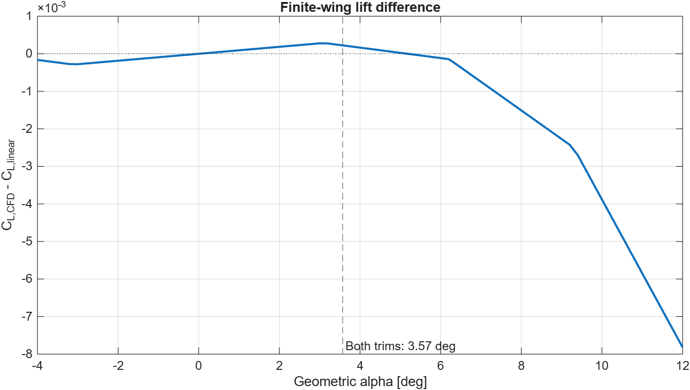

# CFD-Informed Longitudinal Flight Dynamics Simulator

**A reproducible MATLAB study connecting a 2D NACA 0012 Fluent polar to the longitudinal motion of a conceptual aircraft.** The model covers level-flight trim, elevator pulse response, local modes, and sensitivity to pitch-rate damping and assumed inertia. It represents motion in the vertical plane; it does not model six-degree-of-freedom flight.

## Reproduce

Open the repository root as the current folder in **MATLAB R2026a** and run:

```matlab
runProject
```

The command regenerates the polar, derived MAT files, figures, and text summaries from [`data/cfd_results.csv`](data/cfd_results.csv). It uses base MATLAB, with no Simulink, extra toolbox, or ANSYS installation needed for this step. Generated files with the same names are overwritten. Run `setupProject` first if you want to execute individual scripts from `scripts/`.

## Method

```text
Fluent NACA 0012 polar -> MATLAB import and interpolation
-> finite-wing lift and induced drag -> wing, tail and elevator
-> separate level-flight trims -> ode45 elevator pulse
-> local mode analysis and parameter comparisons
```

The source polar contains nine angles from **-4° to 12°** for the **449×129** mesh at **Re = 6 million, Mach = 0.15**. The nominal finite-wing model uses a local linear lift slope; the alternative uses the interpolated CFD section lift with the implicit finite-wing correction. Section drag and moment remain evaluated at geometric angle in both cases, so the comparison isolates wing lift. The polar is never extrapolated.

The state is `[V; gamma; theta; q_pitch; h]`, with `alpha = theta - gamma` and internal angles in radians. The tail includes a quasi-steady geometric pitch-rate term. The nominal `Iyy = 1000 kg·m²` is assumed, and the `kq = 1` tail term is a model estimate, not a CFD derivative.

## Three findings

1. **Reproducible trim:** at 52 m/s, the linear model trims at **alpha = 3.572781°**, **elevator = -4.821444°**, and **thrust = 330.350994 N**. The CFD-lift trim is **3.569632°**, **-4.817190°**, and **330.332486 N**.
2. **Similar local responses:** a relative **-0.5° elevator pulse from 2 to 2.5 s** produces peak `|Delta alpha|` of **0.346727°** (linear) and **0.346948°** (CFD lift). Across the 20 s response, the maximum difference between alpha deviations from their respective trims is **0.000222°**. The two lift laws are close near this trim; their static difference is more visible farther across the available polar.
3. **Pitch-rate sensitivity:** the nominal peak `|q_pitch|` is **1.639474°/s**. Removing the tail pitch-rate term (`kq = 0`) gives **2.408130°/s** under the same pulse. This is sensitivity within the chosen model, not measured aircraft damping.



[Full lift-model comparison](results/wing_lift_model_summary.txt) · [Response figure](results/wing_lift_model_comparison.png) · [Pitch-rate and inertia comparison](results/pitch_damping_inertia_summary.txt)

## Scope and evidence

The [CFD report](docs/cfd/REPORT_CFD.md) compares the **airfoil** polar with experimental Ladson data linked by the [NASA Turbulence Modeling Resource](https://tmbwg.github.io/turbmodels/naca0012_val.html). The reported RMSE is **0.011526 in section lift coefficient** and **0.001135 in section drag coefficient**. The fine-mesh case did not meet the chosen stability criterion within 800 iterations. **The conceptual aircraft dynamics have no experimental validation.** Negative real parts of the local eigenvalues establish only local stability of this model. A 20 s pulse run does not show full settling of the slow mode.

The model assumes constant density, a quarter-chord center of gravity, thrust along the flight path, a linear tail, and no fuselage or tail drag, stall, aerodynamic lag, or lateral dynamics. The 2D polar and finite-wing correction do not represent 3D CFD of the aircraft. The [technical report](docs/REPORT_PROGETTO.md) and [pitch-rate report](docs/REPORT_SMORZAMENTO_IYY.md) retain the detailed analysis in Italian; the [earlier elevator report](docs/REPORT_RISPOSTA_ELEVATORE.md) is explicitly a `kq = 0` historical baseline.

## Repository contents

- `config/`, `src/`, `scripts/`, `examples/`: MATLAB parameters, functions, reproducible analyses, and small examples.
- `data/cfd_results.csv`: original project CFD output. [Data provenance](data/PROVENIENZA.md) documents source conditions and experimental attribution.
- `results/`: selected figures and summaries; MAT outputs are regenerated by `runProject`.
- `docs/`: CFD and flight-dynamics reports in Italian.

**Contribution:** Nicola Blinov carried out the Fluent CFD campaign and physical model setup and wrote part of the MATLAB code. MATLAB implementation and documentation were also developed with Codex assistance.

**Code licensing:** no license is granted for this repository's code. GitHub's [licensing guidance](https://docs.github.com/en/repositories/managing-your-repositorys-settings-and-features/customizing-your-repository/licensing-a-repository) explains the implications. Experimental data are attributed to the NASA TMR source; the raw experimental copy is not included here.
