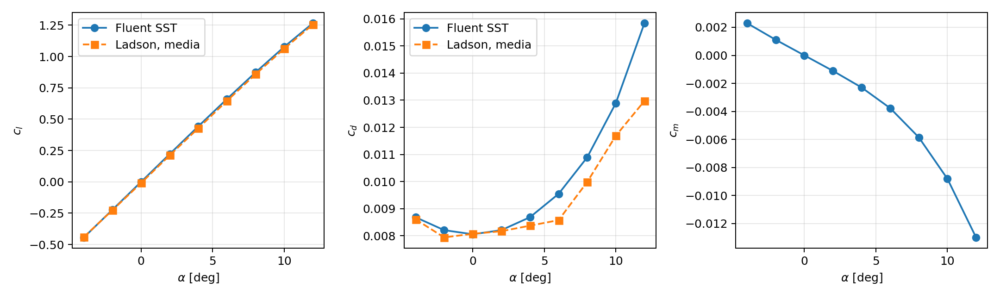
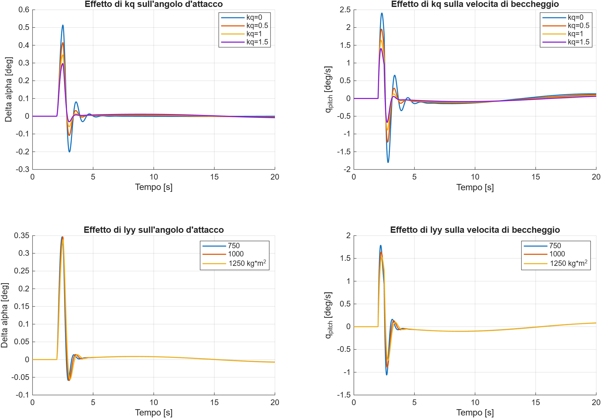

# Report del lavoro svolto — CFD-Informed Flight Dynamics

**Data:** 1 ottobre 2026. **Ambiente MATLAB verificato:** R2026a. **Stato:** fase CFD minima, simulatore longitudinale, effetto di q_pitch, sensibilita a Iyy e confronto lineare/CFD completati.

## 1. Obiettivo e perimetro attuale

Il progetto collega coefficienti aerodinamici ottenuti con CFD a una simulazione di dinamica del volo. Il percorso originale prevedeva un simulatore 6-DOF; per contenere complessità e costo si è prima costruito un modello nel piano longitudinale.

Sono implementati importazione della polare, interpolazione, fit locale, correzione di ala finita, piano di coda, trim, integrazione delle equazioni del moto, impulso di elevatore, analisi dei modi, stima geometrica quasi stazionaria dell’effetto di q_pitch sulla coda e sensibilita a Iyy. Non sono ancora implementati dinamica laterale, modello 6-DOF o derivate dinamiche CFD. Il confronto tra portanza CFD e lineare e ora implementato con trim distinti.

## 2. Studio CFD del profilo

Il tutorial iniziale era inviscido e non costituiva una base adeguata per la resistenza viscosa. La campagna successiva ha usato NACA 0012 2D e RANS stazionario SST k-omega completamente turbolento in ANSYS Fluent.

| Condizione CFD | Valore |
|---|---:|
| Reynolds sulla corda | 6 000 000 |
| Mach | 0.15 |
| Corda | 1 m |
| Velocità | 52.063691 m/s |
| Temperatura | 300 K |
| Densità | 2.127394 kg/m³ |
| Viscosità | 1.846e-5 Pa*s |
| Riferimento del momento | quarto di corda |
| Mesh principale | 449x129, 57 344 celle |
| Intervallo | -4..12 deg, nove punti |

### Polare principale

| Alpha [deg] | cl | cd | cm |
|---:|---:|---:|---:|
| -4 | -0.443165 | 0.008688 | 0.002291 |
| -2 | -0.222144 | 0.008211 | 0.001107 |
| 0 | -0.000005 | 0.008059 | -0.000001 |
| 2 | 0.222134 | 0.008211 | -0.001109 |
| 4 | 0.443155 | 0.008688 | -0.002294 |
| 6 | 0.661191 | 0.009548 | -0.003769 |
| 8 | 0.873531 | 0.010894 | -0.005851 |
| 10 | 1.076908 | 0.012891 | -0.008807 |
| 12 | 1.265814 | 0.015838 | -0.012984 |

Valori completi nel [CSV sorgente](../data/cfd_results.csv). La campagna è documentata dal [report CFD](cfd/REPORT_CFD.md) e dalla [provenienza dei dati](../data/PROVENIENZA.md).

### Confronto sperimentale e mesh

La campagna confronta i nove punti con la media di tre dataset Ladson con transizione forzata. Le metriche importate dalla fase CFD sono:

- RMSE cl: 0.011526.
- Massimo errore assoluto cl: 0.015029.
- RMSE cd: 0.001135.
- Massimo errore assoluto cd: 0.002866, a 12 deg.

La resistenza è progressivamente sovrastimata alle incidenze maggiori. Non è stata studiata la regione di stallo.

Sono state considerate tre mesh a 0 deg: 14 336, 57 344 e 229 376 celle. I rispettivi cd sono circa 0.007857, 0.008059 e 0.008159. La mesh fine non ha raggiunto il criterio di stabilità entro 800 iterazioni; il valore riportato è una media delle ultime 200. Questa è una verifica preliminare di sensibilità, non un GCI formale o una dimostrazione completa di convergenza della mesh.

## 3. Importazione e interpolazione in MATLAB

`importPolar` seleziona la mesh 449x129, ordina gli angoli, verifica nove punti e assenza di NaN nei coefficienti, quindi salva la tabella `polar` in `data/polarNACA0012.mat`.

`airfoilCoefficients` usa interpolazione lineare per cl, cd e cm. Riceve l'angolo in gradi. Il controllo di intervallo ammette una tolleranza di 1e-10 deg per gestire la conversione radianti-gradi ai bordi. Piccoli scostamenti vengono riportati esattamente sul limite; gli angoli realmente esterni alla polare causano un errore.

Il fit sui cinque punti tra -4 e +4 deg, con angoli in radianti, fornisce:

$$c_l = a_0\alpha+b$$

$$a_0 = 6.351001\ \mathrm{rad}^{-1},\qquad b\simeq-4.9240\times10^{-6}$$

$$\alpha_{0L}\simeq0.000044\ \mathrm{deg},\qquad R^2\simeq0.99999898$$

Il coefficiente di determinazione descrive la qualità del fit nella zona scelta, non la validità del modello fino allo stallo.

## 4. Velivolo concettuale e ala finita

| Parametro | Valore |
|---|---:|
| Massa | 600 kg |
| Peso | 5886 N |
| Superficie alare S | 14 m² |
| Apertura b | 8 m |
| Corda media | 1.75 m |
| Allungamento AR | 4.571429 |
| Efficienza e | 0.8 |
| Densità del modello MATLAB | 1.225 kg/m³ |
| Velocità iniziale | 52 m/s |
| Iyy assunto | 1000 kg*m² |
| Fattore nominale della stima da q_pitch, kq | 1 |
| Superficie di coda | 3 m² |
| Braccio di coda | 3 m |
| Rapporto di pressione dinamica eta_t | 0.9 |
| Pendenza della coda a_t | 4 rad^-1 |
| Incidenza della coda | 0 deg |
| Efficacia elevatore tau_e | 0.5 |
| Gradiente di downwash | 0.35 |
| Volume di coda VH | 0.367347 |

I parametri definiscono un velivolo didattico, non un aeromobile identificato sperimentalmente. La densità CFD e quella della dinamica sono diverse: il modello riutilizza la polare al Reynolds di riferimento e non ricalcola la CFD per ogni variazione di velocità.

La pendenza dell'ala finita è:

$$a_w=\frac{a_0}{1+a_0/(\pi eAR)}=4.090091\ \mathrm{rad}^{-1}$$

Il modello lineare di riferimento usa:

$$C_{L_w}=a_w(\alpha-\alpha_{0L})$$

$$C_{D_w}=c_{d,CFD}(\alpha)+\frac{C_{L_w}^2}{\pi eAR}$$

La correzione è una prima approssimazione: non costituisce una simulazione CFD 3D dell'ala. Nel nuovo modello CFD, la portanza usa l'angolo efficace; cd e cm restano valutati all'angolo geometrico in entrambi i modelli, per isolare il cambiamento della legge di portanza.

## 5. Coda ed equilibrio longitudinale

La portanza della coda dipende dall'angolo efficace:

$$\alpha_t=(1-\varepsilon_\alpha)\alpha+i_t+\tau_e\delta_e+k_q\frac{l_t q_{pitch}}{V},\qquad C_{L_t}=a_t\alpha_t$$

Con il baricentro al quarto di corda:

$$C_{m,tot}=c_{m,CFD}(\alpha)-\eta_tV_HC_{L_t}$$

Al trim `q_pitch=0`, quindi il nuovo termine non altera la ricerca dell’equilibrio. La ricerca del trim usa `fzero` per annullare la forza verticale residua. Per ogni angolo provato viene ricavata la portanza di coda necessaria ad annullare il momento; successivamente si determina la deflessione dell'elevatore e si verificano entrambi gli equilibri.

| Risultato al trim | Valore |
|---|---:|
| Alpha senza coda | 3.556105 deg |
| Alpha con coda | 3.572781 deg |
| Deflessione elevatore | -4.821444 deg |
| CL ala | 0.25504174 |
| CL coda | -0.00617251 |
| Cm ala | -0.00204071 |
| Portanza ala | 5913.601864 N |
| Forza coda | -27.601864 N |
| Forza totale | 5886 N |
| Errore verticale | circa 3.39e-9 N |
| Momento totale | circa 1.76e-13 N*m |
| Resistenza e spinta del modello | 330.350994 N |

La coda produce una piccola forza verso il basso, perciò l'ala deve sostenere leggermente più del peso. La spinta è posta uguale alla resistenza sotto l'ipotesi che agisca lungo la traiettoria.

## 6. Aerodinamica durante il moto

`aircraftAerodynamics` restituisce L, D e M per velocità, angolo d'attacco ed elevatore assegnati. Nel moto la coda viene calcolata dall'elevatore: il momento non viene imposto nullo, altrimenti il velivolo non potrebbe reagire al comando.

$$L=\bar q S C_{L_w}+\bar q\eta_tS_tC_{L_t}$$

$$D=\bar q S C_{D_w},\qquad M=\bar q S\bar c C_{m,tot},\qquad \bar q=\tfrac12\rho V^2$$

Momento positivo significa muso verso l'alto; elevatore positivo aumenta la portanza della coda. `kq=1` usa il moto verticale della coda come stima quasi stazionaria; `kq=0` ripristina il modello precedente. Con `qhat=q_pitch*c_bar/(2V)`, la derivata del momento di questo modello e `Cm_q=-2*kq*eta_t*VH*a_t*lt/c_bar=-4.534111` al valore nominale. Non e stata ricavata dalla CFD statica.

## 7. Equazioni del moto e integrazione

Lo stato contiene cinque variabili: velocità V, angolo di traiettoria gamma, assetto theta, velocità di beccheggio q_pitch e quota h. Cinque variabili di stato non equivalgono a cinque gradi di libertà: questo è un modello nel piano verticale.

$$\alpha=\theta-\gamma$$

$$\dot V=\frac{T-D}{m}-g\sin\gamma$$

$$\dot\gamma=\frac{L-mg\cos\gamma}{mV}$$

$$\dot\theta=q_{pitch},\qquad\dot q_{pitch}=\frac{M}{I_{yy}},\qquad\dot h=V\sin\gamma$$

`longitudinalDynamics` calcola le derivate; gli script di simulazione le integrano con `ode45`. Spinta ed elevatore sono assegnati e la densità resta costante.

La simulazione corrente senza perturbazione mantiene il trim per 20 s: dopo la modifica fisica lo scostamento massimo di velocità è circa 2.86e-11 m/s e quello di quota circa 1.74e-10 m. Si tratta di una verifica numerica di consistenza.

## 8. Risposta precedente: riferimento kq=0

L'analisi iniziale dell'impulso, conservata nel [report della risposta di riferimento](REPORT_RISPOSTA_ELEVATORE.md), usa `kq=0`, cioe nessun termine esplicito da `q_pitch`. L'elevatore diminuisce di 0.5 deg tra 2 e 2.5 s, poi torna al trim. La simulazione e divisa in tre intervalli per applicare i cambi di comando conservando lo stato.

| Scostamento massimo precedente | Valore |
|---|---:|
| Velocità | 0.346080 m/s |
| Angolo d'attacco | 0.514421 deg |
| Assetto | 0.991739 deg |
| Velocità di beccheggio | 2.408130 deg/s |
| Quota | 1.834362 m |

I modi locali precedenti erano rapido `-1.709485 +/- 5.770799 i` e lento `-0.007235 +/- 0.266817 i`, entrambi con parte reale negativa. Il decadimento del modello precedente derivava dall'accoppiamento delle equazioni, pur senza un termine esplicito da `q_pitch`.

## 9. Effetto di q_pitch e sensibilita a Iyy

La nuova stima modifica l'angolo efficace della coda di `kq*lt*q_pitch/V`: per beccheggio positivo la portanza di coda cresce e il suo momento contrasta la rotazione. Lo stesso trim e lo stesso impulso relativo sono applicati a `kq=0, 0.5, 1, 1.5` con `Iyy=1000 kg*m²`; poi a `Iyy=750, 1000, 1250 kg*m²` con `kq=1`. Questi intervalli illustrano la sensibilita e non sono incertezze misurate.

| Caso | Max abs(Delta alpha) [deg] | Max abs(q_pitch) [deg/s] | Max abs(Delta V) [m/s] |
|---|---:|---:|---:|
| kq=0, Iyy=1000 | 0.514421 | 2.408130 | 0.346080 |
| kq=1, Iyy=1000 | 0.346727 | 1.639474 | 0.306579 |
| kq=1, Iyy=750 | 0.346664 | 1.790189 | 0.305482 |
| kq=1, Iyy=1250 | 0.338708 | 1.529325 | 0.307666 |

Nel modello nominale corrente, il modo rapido ha autovalori `-3.257524 +/- 5.917321 i` (periodo 1.061829 s, tempo e-fold 0.306982 s) e il lento `-0.007106 +/- 0.237724 i` (periodo 26.430613 s, tempo e-fold 140.721646 s). I 20 s della simulazione non mostrano l'assestamento del modo lento. La parte reale negativa dei modi e un risultato della linearizzazione locale, non una validazione sperimentale del velivolo.

Tutti i sei casi, la formula del coefficiente e gli autovalori sono nel [report dedicato](REPORT_SMORZAMENTO_IYY.md). Il caso `kq=0` riproduce i massimi precedenti entro 5e-5 nelle rispettive unita.

## 10. Portanza CFD non lineare e confronto dei modelli

`aircraft.wingLiftModel` seleziona `"linear"` (valore nominale e compatibilità con le strutture precedenti) oppure `"cfd"`. Il nuovo modello interpola linearmente `cl` ai nove angoli della polare e risolve la correzione di ala finita:

$$C_{L_w}=c_{l,CFD}(\alpha_{eff}),\qquad \alpha=\alpha_{eff}+\frac{C_{L_w}}{\pi e AR}.$$

La funzione costruisce la mappa dei punti `\alpha_{geo,i}=\alpha_{CFD,i}+c_{l,i}/(\pi e AR)` e la interpola inversamente. Per questa polare la mappa e monotona; la verifica numerica su 81 angoli tra -4 e 12 deg ha dato un errore massimo della relazione implicita di `2.220e-16`. Gli angoli fuori dominio causano un errore, senza estrapolazione. Il momento e la resistenza del profilo continuano a usare l'angolo geometrico in entrambi i modelli, cosi il confronto cambia soltanto la legge della portanza dell'ala.

I due modelli mantengono gli stessi parametri, `kq=1`, `Iyy=1000 kg*m²`, velocita di 52 m/s e impulso relativo di -0.5 deg tra 2 e 2.5 s. Ogni modello ha il proprio trim e la propria spinta di equilibrio.

| Grandezza | Lineare | CFD non lineare |
|---|---:|---:|
| Alpha al trim [deg] | 3.572781 | 3.569632 |
| Elevatore al trim [deg] | -4.821444 | -4.817190 |
| Spinta al trim [N] | 330.350994 | 330.332486 |
| Max abs(Delta alpha) [deg] | 0.346727 | 0.346948 |
| Max abs(q_pitch) [deg/s] | 1.639474 | 1.639197 |
| Max abs(Delta V) [m/s] | 0.306579 | 0.306036 |
| Delta h a 20 s [m] | -1.275307 | -1.273673 |

Il modo rapido CFD ha autovalori `-3.254556 +/- 5.917402 i`; il lento `-0.007110 +/- 0.237772 i`. La parte reale e negativa in questa linearizzazione locale. Lo scarto massimo fra gli scostamenti di alpha dai rispettivi trim e `0.000222 deg` su una griglia comune di 0.02 s. Il confronto nominale mostra differenze piccole; la curva statica da -4 a 12 deg mostra invece che lo scarto CL_CFD-CL_lineare varia da -0.007819 a +0.000278. I due trim cadono nella zona quasi lineare della polare (circa 3.57 deg), e l'impulso rimane vicino al trim: per questo le risposte quasi coincidono. Il presente impulso non verifica la dinamica ad alte incidenze.

Nel `runProject` completato il 1 ottobre 2026, il modello lineare ha riprodotto i risultati precedenti. Per il caso CFD, `L-W=0` alla precisione riportata e `M=3.519e-14 N*m`; lo stato senza impulso e rimasto entro `1.062e-17` nelle componenti numeriche in 20 s. Per entrambi, i raccordi dello stato ai cambi di comando sono nulli alla precisione controllata. Il [riepilogo](../results/wing_lift_model_summary.txt), il [grafico delle risposte](../results/wing_lift_model_comparison.png) e la [curva dello scarto statico](../results/wing_lift_static_difference.png) raccolgono il confronto. I dati MAT sono rigenerati da `runProject`.

## 11. Organizzazione, verifica e riproducibilita

Le funzioni sono in `src/`, i parametri in `config/`, le procedure in `scripts/` e gli esempi in `examples/`. `setupProject` configura i percorsi; `runProject` esegue tutte le analisi, inclusi il confronto di smorzamento/inerzia e quello lineare/CFD. Gli script ricavano la radice dal proprio percorso e il runner isola i loro comandi `clear`.

Il 1 ottobre 2026 `runProject` e stato completato in MATLAB R2026a anche dopo l'aggiunta del confronto lineare/CFD. La verifica precedente dei percorsi includeva l'avvio da una cartella corrente esterna. Sono stati verificati errore di portanza al trim circa `3.39e-9 N`, momento circa `1.76e-13 N*m`, mantenimento del trim senza impulso, riproduzione del vecchio riferimento, stati finiti e continuita nei raccordi dei sei casi. Un controllo mirato ha verificato il segno del momento per `q_pitch` positivo e negativo e il mantenimento del trim prima del comando. Non sono stati ripetuti calcoli Fluent.

## 12. Limiti e lavoro successivo

La validazione sperimentale disponibile riguarda il profilo CFD, non la dinamica del velivolo concettuale. `Iyy` e stimato; l'effetto da `q_pitch` e una stima geometrica quasi stazionaria della sola coda, senza ritardi aerodinamici o downwash dinamico. Restano assunti geometria, coda, CG al quarto di corda, densita costante e direzione della spinta. Sono assenti resistenza di fusoliera/coda, stallo e dinamica laterale. La polare non va estrapolata fuori -4..12 deg.

Prossime attivita:

1. Valutare la sensibilita del confronto alle ipotesi di ala finita e ai dati CFD disponibili.
2. Affinare `Iyy` se diventano disponibili dati del velivolo; la sensibilita a valori ipotetici e gia stata svolta.
3. Valutare il 6-DOF solo se saranno disponibili forze e momenti sugli altri assi.
