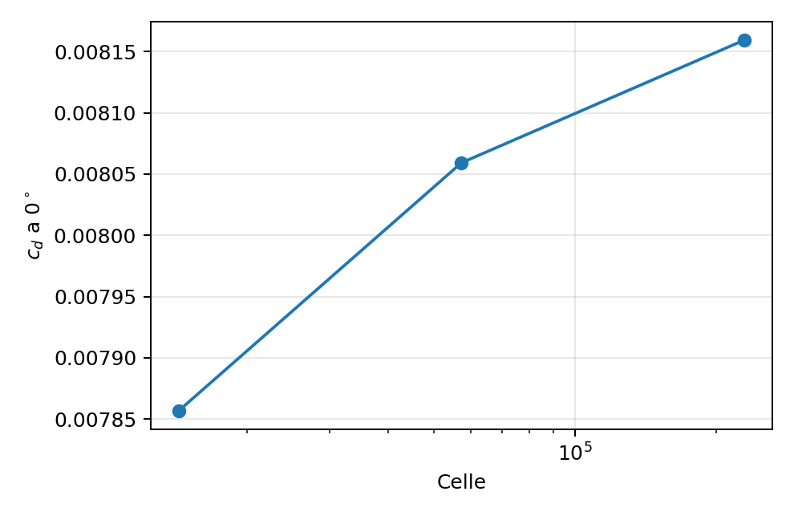

# Report finale minimo — studio CFD NACA 0012

## Obiettivo e risultato

È stato costruito un caso CFD 2D viscoso distinto dal tutorial inviscido iniziale. Il caso produce una polare aerodinamica utilizzabile come primo dataset per il simulatore di dinamica del volo. Il risultato principale è in [`cfd_results.csv`](../../data/cfd_results.csv); la polare consigliata è quella della mesh **449×129**. Questo documento descrive la fase CFD; il successivo lavoro MATLAB è documentato nel [report del progetto](../REPORT_PROGETTO.md).

Il caso riproduce bene la portanza sperimentale nell’intervallo da −4° a 12°. La resistenza coincide quasi esattamente a 0° e viene progressivamente sovrastimata alle incidenze maggiori, fino a circa 0,00287 a 12°. Questo limite deve rimanere esplicito quando i dati saranno usati nel simulatore.

## Configurazione

| Voce | Impostazione |
|---|---|
| Profilo | NACA 0012, definizione TMR con bordo d’uscita chiuso |
| Solver | Ansys Fluent 2026 R1, 2D, doppia precisione, stazionario |
| Modello | RANS SST k–ω, completamente turbolento |
| Mach | 0,15 |
| Reynolds sulla corda | 6.000.000 |
| Corda | 1 m |
| Velocità | 52,064 m/s |
| Temperatura | 300 K |
| Densità | 2,1274 kg/m³ |
| Viscosità | 1,846×10⁻⁵ Pa·s |
| Turbolenza all’infinito | intensità 0,052%; rapporto μt/μ = 0,009 |
| Dominio | C-grid TMR, confine esterno a circa 500 corde |
| Centro del momento | quarto di corda, (0,25 m; 0) |

Le condizioni seguono il [caso di validazione NACA 0012 del NASA Turbulence Modeling Resource](https://tmbwg.github.io/turbmodels/naca0012_val.html). I dati sperimentali sono quelli di Ladson con transizione forzata, coerenti con l’ipotesi di strato limite completamente turbolento.

## Polare CFD consigliata

| α [°] | cl | cd | cm al c/4 |
|---:|---:|---:|---:|
| −4 | −0,44316 | 0,008688 | 0,002291 |
| −2 | −0,22214 | 0,008211 | 0,001107 |
| 0 | −0,00001 | 0,008059 | −0,000001 |
| 2 | 0,22213 | 0,008211 | −0,001109 |
| 4 | 0,44316 | 0,008688 | −0,002294 |
| 6 | 0,66119 | 0,009548 | −0,003769 |
| 8 | 0,87353 | 0,010894 | −0,005851 |
| 10 | 1,07691 | 0,012891 | −0,008807 |
| 12 | 1,26581 | 0,015838 | −0,012984 |

Tutti questi punti hanno soddisfatto il criterio pratico adottato sulla stabilità delle forze tra blocchi successivi di iterazioni. I file completi di caso e soluzione sono nella cartella `runs/` dell'archivio CFD originale, esterno a questo progetto MATLAB; vedere [provenienza dei dati](../../data/PROVENIENZA.md).

## Confronto con gli esperimenti

Sui nove angoli calcolati, rispetto alla media dei tre dataset Ladson con diversa rugosità di trip:

- RMSE di portanza: **0,0115**.
- Errore massimo assoluto di portanza: **0,0150**.
- RMSE di resistenza: **0,00114**.
- Errore massimo assoluto di resistenza: **0,00287**, a 12°.
- A 0°: cd CFD **0,008059**, media sperimentale **0,008076**.
- A 10°: cl CFD **1,07691**, media sperimentale **1,06283**; cd CFD **0,012891**, media sperimentale **0,011689**.

La tabella punto per punto con i valori sperimentali copiati resta nell'archivio di sviluppo, fuori dal repository pubblico; per i dati originali si veda il link NASA TMR sopra. La dispersione fra esperimenti cresce avvicinandosi allo stallo; questa campagna si ferma a 12° e non pretende di descrivere lo stallo.

## Sensibilità alla mesh

| Mesh | Celle | cd a 0° |
|---|---:|---:|
| 225×65 | 14.336 | 0,007857 |
| 449×129 | 57.344 | 0,008059 |
| 897×257 | 229.376 | 0,008159 ± 0,000009 |

La variazione di cd è circa **2,6%** dalla mesh grossolana alla media e **1,2%** dalla media alla fine. La mesh fine non ha soddisfatto il criterio di stabilità entro 800 iterazioni; il suo valore è quindi la media delle ultime 200 iterazioni e la deviazione standard è indicata in tabella. Non è stato calcolato un GCI formale. Per un progetto minimo, la mesh intermedia offre il miglior compromesso fra costo, stabilità e accordo sperimentale.

## Modello lineare per il confronto nel simulatore

Un fit locale sui punti da −4° a 4°, con α espresso in radianti, dà:

\[
c_l^{lin}(\alpha)=-4,92\times10^{-6}+6,3510\,\alpha
\]

\[
c_m^{lin}(\alpha)=-1,20\times10^{-6}-0,03262\,\alpha
\]

Un fit parabolico della resistenza sui nove punti dà:

\[
c_d\approx0,007800+0,004677\,c_l^2.
\]

I coefficienti con piena precisione sono in [`linear_model.json`](../../data/reference/linear_model.json). Il simulatore confronta ora la portanza lineare con la portanza CFD interpolata e corretta per ala finita; vedere il [report del progetto](../REPORT_PROGETTO.md).

## Limiti e uso corretto

- I dati descrivono un **profilo 2D**, non il velivolo completo. Prima del simulatore servono correzione di ala finita, resistenza indotta, impennaggi, fusoliera e derivate dinamiche.
- Il momento è riferito al quarto di corda e usa l’asse z positivo del piano CFD; il segno va convertito coerentemente negli assi corpo del simulatore.
- Il modello è stazionario e completamente turbolento. Non descrive transizione naturale, stallo dinamico o isteresi.
- La polare è valida alle condizioni indicate. Per grandi variazioni di velocità o quota servirebbero altri Reynolds e Mach.
- I risultati oltre 12° e l’intera regione di stallo non sono disponibili e non devono essere estrapolati silenziosamente.

## Materiale nel repository pubblico

Sono inclusi il CSV CFD prodotto nel progetto, le condizioni del caso, i fit originari, le metriche riassuntive e le figure del report. I dati sperimentali grezzi e la tabella punto per punto che li copia restano fuori dal repository; la fonte è la pagina NASA TMR citata sopra. Mesh, file di caso e soluzione Fluent e script della campagna rimangono nell'archivio di sviluppo esterno.

La fase CFD minima è completa. Il lavoro MATLAB successivo comprende ala finita, trim, dinamica longitudinale e confronto della portanza lineare con quella CFD; vedere il [report aggiornato](../REPORT_PROGETTO.md). Il 6-DOF rimane un eventuale sviluppo futuro.
